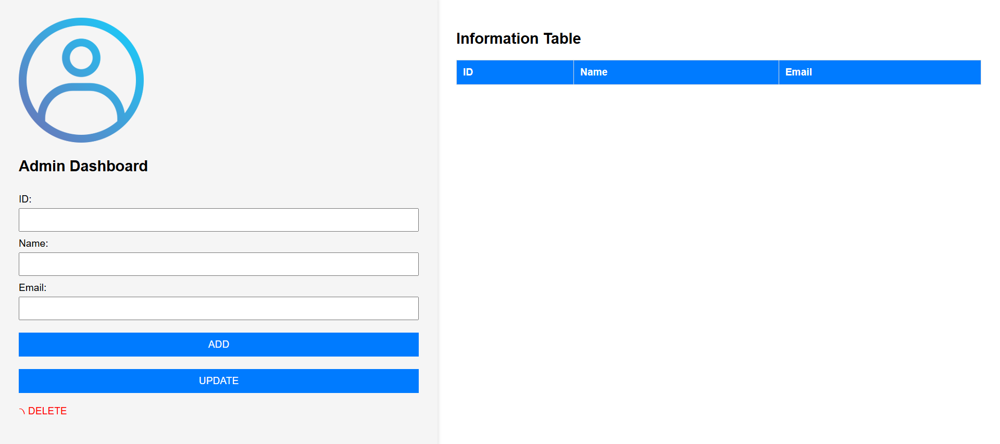

# HoverTeam
# Admin Dashboard – Student Management

A simple CRUD (Create, Read, Update, Delete) web application built using **PHP**, **HTML**, **CSS**, and **JavaScript**. This project allows administrators to manage student records with a clean and responsive interface.

---

## 📸 Preview



---

## 🚀 Features

- 🔹 Add new students
- 🔹 Update existing records
- 🔹 Delete student entries
- 🔹 Display all students in a table format
- 🔹 Clean and minimal UI

---

## 🧰 Technologies Used

- ✅ PHP (backend logic)
- ✅ HTML5 / CSS3 (structure & styling)
- ✅ JavaScript (DOM manipulation / UX)
- ✅ MySQL (for data storage)

---

## ⚙️ How to Run Locally

1. Clone the repository:

```bash
git clone https://github.com/Alex2004111/HoverTeam.git
