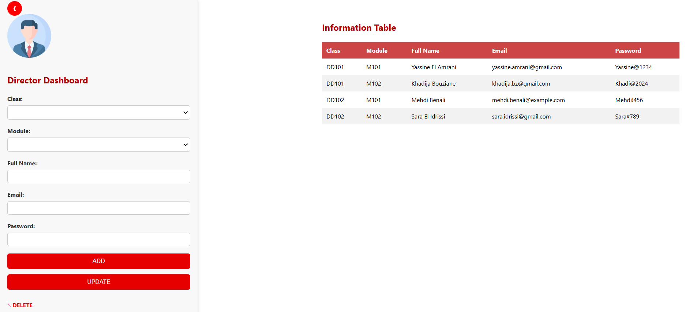
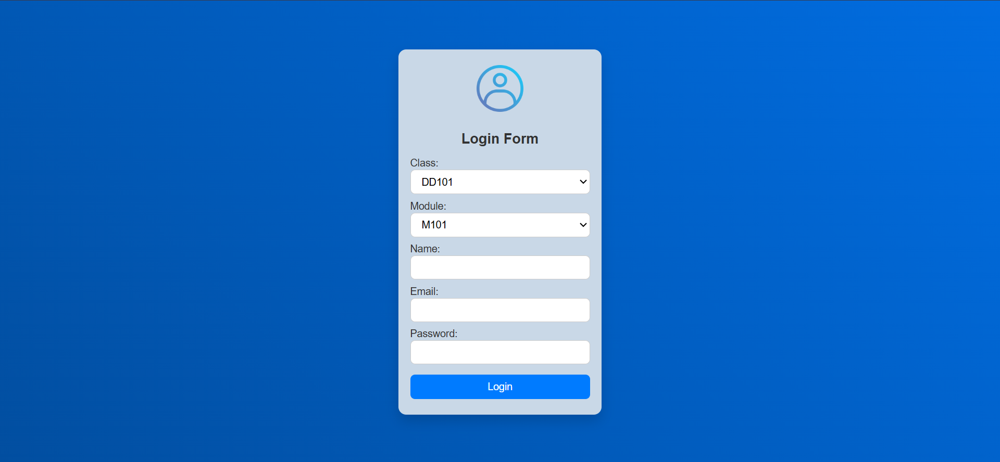
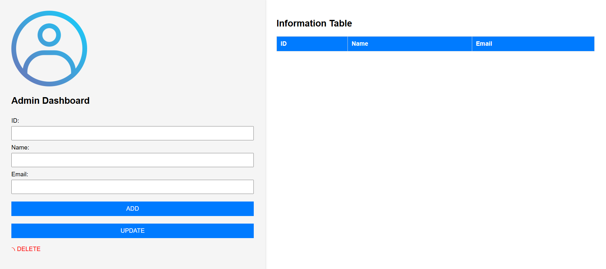

# 📊 Director Dashboard

## Description
This is a simple **Director Dashboard** that allows the director to interact with data through a responsive sidebar and main content area. The dashboard provides a form for adding, updating, and deleting information such as IDs, names, and emails, while also displaying this information in a table. The layout features a sleek design with animations and smooth transitions for a better user experience.

## Features
- Responsive design
- Collapsible sidebar with toggle button
- Smooth animations for interactions
- Form with CRUD operations
- Table display of data

## Technologies Used
- HTML5
- CSS3 (with animations)
- JavaScript

## 📸 Screenshot

| Director Interface |
|--------------------|
|  |

---

# 🔐 Login Page

## Description
This module secures access to the student management system. The administrator selects a **class** and a **module**, then enters login credentials. The system verifies the data and grants access to the dashboard upon success.

## Features
- Class and module selection
- Credential authentication
- Access control logic
- Responsive and user-friendly design

## Technologies Used
- HTML5 / CSS3
- JavaScript
- Backend language (e.g., PHP / Node.js)
- Database (e.g., MySQL / MongoDB)

## 📸 Screenshot

| Login Interface |
|-----------------|
|  |

---

# 🧑‍💻 Admin Dashboard – HoverTeam

## Description
A simple CRUD web application that allows administrators to manage student records with a clean and responsive interface.

## Features
- Add, update, delete student records
- Display students in a styled table
- Responsive and clean design

## Technologies Used
- PHP (backend)
- HTML5 / CSS3
- JavaScript (UX / interactivity)
- MySQL (database)

## 📸 Screenshot

| Admin Interface |
|-----------------|
|  |

---

## ⚙️ How to Run Locally

1. Clone the repository:
```bash
git clone https://github.com/your-username/your-dashboard-repo.git
